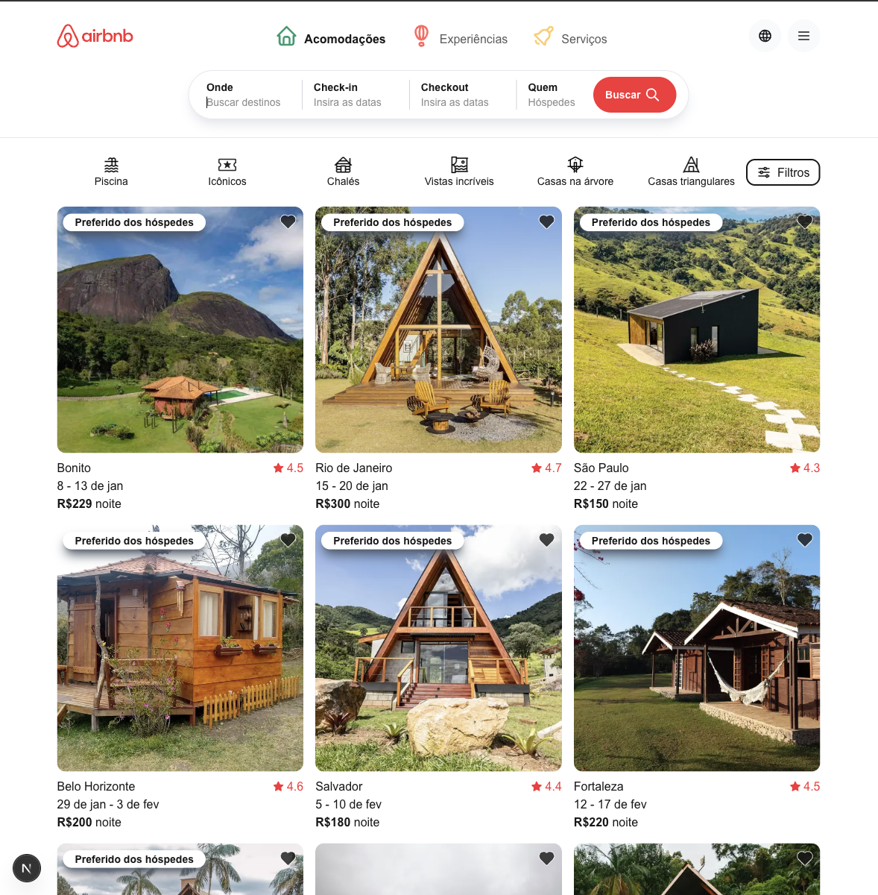
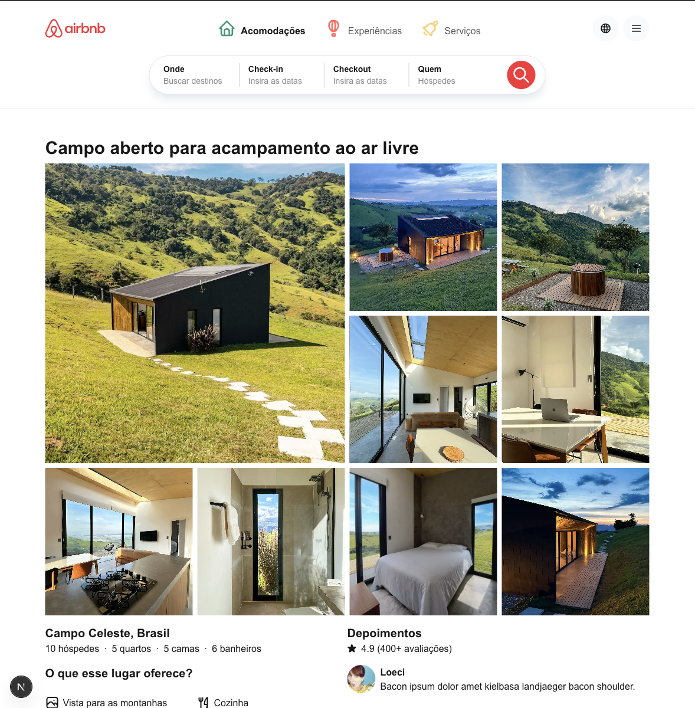

# Airbnb Clone - Next.js

Este projeto é uma aplicação inspirada no Airbnb, desenvolvida com **Next.js**, que consome dados de uma API externa. Ele permite visualizar acomodações disponíveis e acessar detalhes específicos de cada hospedagem.

## Imagens do projeto

### Tela Principal


### Tela de Detalhes


## Tecnologias

- **Next.js** - Framework de React para aplicações modernas
- **TypeScript** - Tipagem segura para um código mais confiável
- **Tailwind CSS** - Estilização eficiente com classes utilitárias
- **API Externa** - Dados fornecidos pela API [`https://web.codans.com.br/airbnb`](https://web.codans.com.br/airbnb)

## Instalação

1. Clone o repositório:
    ```bash
    git clone https://github.com/matheusvsdev/airbnb-next.git
    ```

2. Instale as dependências do projeto:

    ```bash
    npm install
    ```

3. Inicie a aplicação:

    ```bash
    npm run dev
    ```

4. Acesse a url: [http://localhost:3000](http://localhost:3000) no seu navegador.

## Funcionalidades

Página principal: Lista acomodações com imagens e preços.

Detalhes da hospedagem: Ao clicar em uma acomodação, a aplicação redireciona para uma página de detalhes.

Consumo dinâmico da API: Os dados são obtidos diretamente do endpoint.

## Estrutura do projeto

```plaintext
airbnb-clone/
│── .next/      
│── node_modules/      
│── public/      
│── src/
│   ├── app/       
│   ├── assets/    
│   ├── components/ 
│   ├── types/     
│   ├── utils/     
│   ├── widgets/
│── .gitignore
│── eslint.config.mjs
│── next-env.d.ts
│── next.config.ts
│── package-lock.json
│── package.json
│── postcss.config.mjs
│── README.md
│── tsconfig.json
```

# API utilizada

A aplicação consome os dados da API externa, obtendo informações como:
- Título, descrição, localização, fotos da acomodação, etc.

Endpoint: https://web.codans.com.br/airbnb